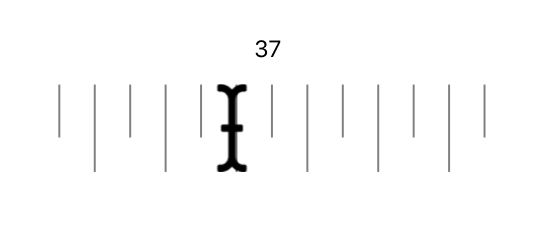

# react-ruler-draggable

> Draggable Ruler component for React

# Presentation




### Features

* draggable cursor with sliding ruler beneath
* ruler respond to drag/drop and wheel event
* callback on value change


## Install

```bash
npm install react-ruler-draggable --save
```

## Usage

``` js
import Ruler from 'react-ruler-draggable';
```

``` js
// basic usage
const onChanged = (value) => {
   console.log(value);
}

<Ruler
   ref={refRuler} // react ref object
   defaultValue={50} // 0 -100
   onChanged={onChanged}
   longLength = {300}
   shortLength = {60}
   horizontal= {true} // true | false
/>
```


``` js
function App() {
  const refRuler = useRef()
  const [value,setValue] = useState(null)

  const pressingDown = () => refRuler.current.pressingDown()
  const pressingUp = () => refRuler.current.pressingUp()
  const stopPressing = () => refRuler.current.stopPressing()
  const onChanged = (value) => setValue(value)

  return (
    <div>
        <button onMouseDown={pressingDown} onMouseUp={stopPressing}>Down</button>
        <button onMouseDown={pressingUp} onMouseUp={stopPressing}>Up</button>
        <div>{value}</div>
        <Ruler
           ref={refRuler}
           defaultValue={50}
           onChanged={onChanged}
           longLength = {300}
           shortLength = {60}
           horizontal= {true}
        />
    </div>
  );
}
```

## Proptypes

```js
   propTypes: {
     // vertical / horizontal
     horizontal: PropTypes.bool,
     // function on value changed
     onChanged: PropTypes.func,
     // initial value 0-100
     defaultValue: PropTypes.number,
     // step when calling pressingUp/pressingDown
     incremental: PropTypes.number,  
     // 0-1 friction, advised between 0.9 -0.98
     frictionCoefficient:PropTypes.number,
     // multiply the length of the initial backgroundImage (default is 20)
     multiplicatorLength:PropTypes.number,
     // React component cursor (default cursor provided)
     cursor:PropTypes.object.isRequired,
     // additionnal inline style to cursor container
     styleCursorContainer:PropTypes.object,
     // length of the long length of the ruler
     longLength:PropTypes.number,
     // short length/height of the ruler
     shortLength:PropTypes.number,
     //replace ruler image
     backgroundImage:PropTypes.string,
     // disable event on ruler
     disabledDragRuler:PropTypes.bool,
     // disable event on mouse wheel
     disabledMouseWheel:PropTypes.bool,
     // disable event on cursor
     disabledCursorDrag:PropTypes.bool,
   }
```


## License

[MIT][mit-license]

[mit-license]: ./LICENSE
